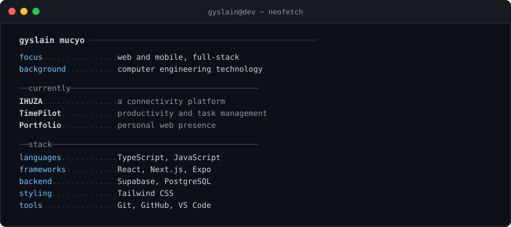

<a href="https://github.com/GyslainM">
  <picture>
    <source media="(prefers-color-scheme: dark)" srcset="./dark_mode.svg">
    
  </picture>
</a>

 

[portfolio](https://portfolio-pi-pearl-38f8mit10q.vercel.app/) ↗ &nbsp;&nbsp; [linkedin](https://www.linkedin.com/in/gyslainmucyo) ↗ &nbsp;&nbsp; [email](mailto:mucyogyslain@gmail.com) ↗
